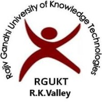
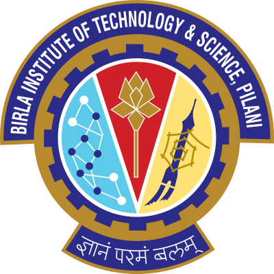
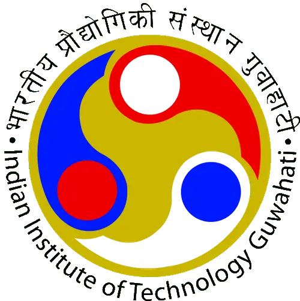
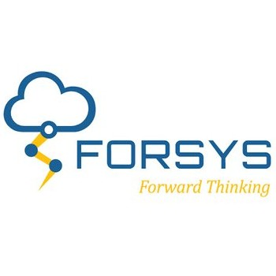

  <h1>Bio</h1>
  
I am currently working as Machine Learning Engineer at <a href="https://www.hitloop.it/"> Hitloop</a>, building Multimodal Multilingual Multitask AI Systems. I'm focused on exploring computer vision applications, including face synthesis and lip regeneration using generative AI. Additionally, I work on speech technologies, developing Text-to-Speech (TTS) systems and Automatic Speech Recognition (ASR) models, along with NLP models for translation systems. I am pursuing an M.Tech in AIML (2023-25) at BITS Pilani WILP, balancing my studies with my professional role.

  

    

      
    

    
B.Tech, Electronics & Com.,  IIIT, <a href="https://www.rguktrkv.ac.in/" style="color: #2985d8; text-decoration: none;">RGUKT RK Valley</a>, India Aug. 2018 - May. 2022

  

  

    

      
    

    
M.Tech, Artificial Intelligence & ML, <a href="http://www.bits-pilani.ac.in/" style="color: #2985d8; text-decoration: none;">BITS Pilani</a>, India Nov. 2023 - Oct. 2025

  

    

    

      
    

    
Research Intern  <a href="http://www.bits-pilani.ac.in/" style="color: #2985d8; text-decoration: none;">IIT Guwahati</a>, India Mar. 2021 - Jul. 2021

  

  

    

      
    

    
Software Engineer  <a href="https://www.forsysinc.com/" style="color: #2985d8; text-decoration: none;">Forsys Inc.</a>, India, Jun. 2022 - Apr. 2023

  

  

    

      
    

    
Machine Learning Engineer, <a href="https://www.hitloop.it/" style="color: #2985d8; text-decoration: none;">Hitloop</a>, India Apr. 2023 - Pres.

  

 

  <h2>Research</h2>
  

    My research interest broadly includes <strong>Computer Vision focused on face synthesis, Lip regeneration, Visual Language models(VLMs), Speech applications</strong> and I worked on TTS Speech synthesis models on indic languages, ASR systems and translation language models. I'm actively looking forward to collaborate on Research work on Computer Vision, Speech. Please see the <a href="/cv/" style="color: #2985d8; text-decoration: none;">CV</a> section to know more about my Education, Skills and Experiences.
  

  <h2>Updates</h2>
  <ul class="updates-list">
    <li><strong>[Feb. 2024]</strong> Attended two-day India's Biggest GenAI Summit, the Machine Learning Developers Summit <a href="https://mlds.analyticsindiamag.com/"> (MLDS2024)</a> held in Bangalore</li>
    <li><strong>[Apr. 2023]</strong> Started my Master's in Artificial Intelligence and Machine Learning in BITS Pilani, India</li>
    <li><strong>[Aug. 2023]</strong> Elected as an External Secretary for the RGUKT RK Valley Alumni Association (RGURAA)</li>
    <li><strong>[Aug. 2023]</strong> Successfully completed the 30-day <a href="https://cvit.iiit.ac.in/summerschool2023/"> 7th Summer School</a> on AI with a focus on Computer Vision & Machine Learning, hosted by CVIT, IIIT Hyderabad</li>
    <li><strong>[Apr. 2023]</strong> Started new journey as a founding Machine Learning Engineer at Hitloop, India</li>
    <li><strong>[Apr. 2023]</strong> My journey as a Software Engineer at Forsys has ended to purse core research on AI</li>
  </ul>

 

