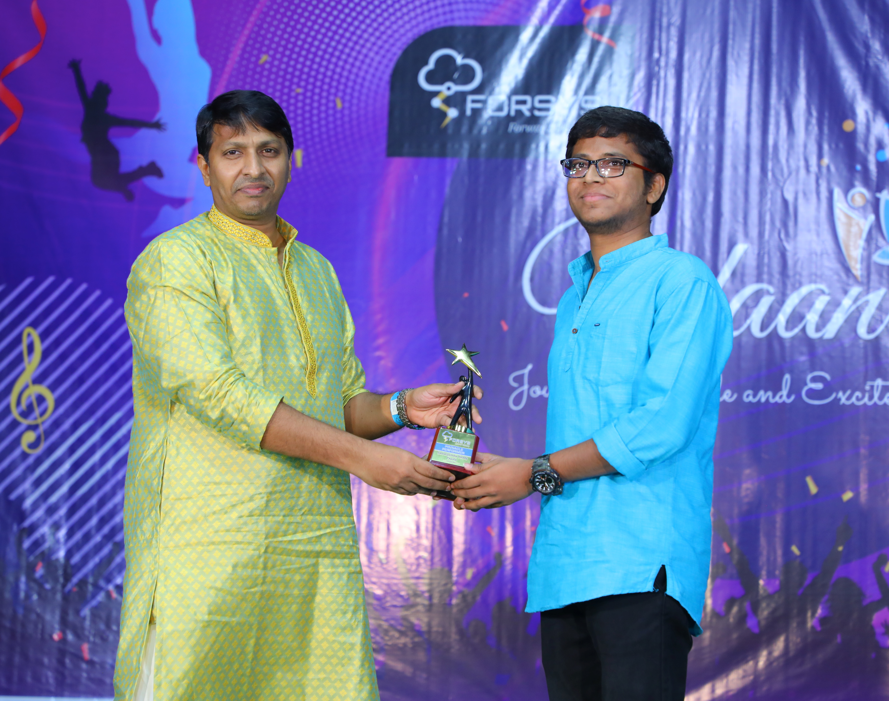
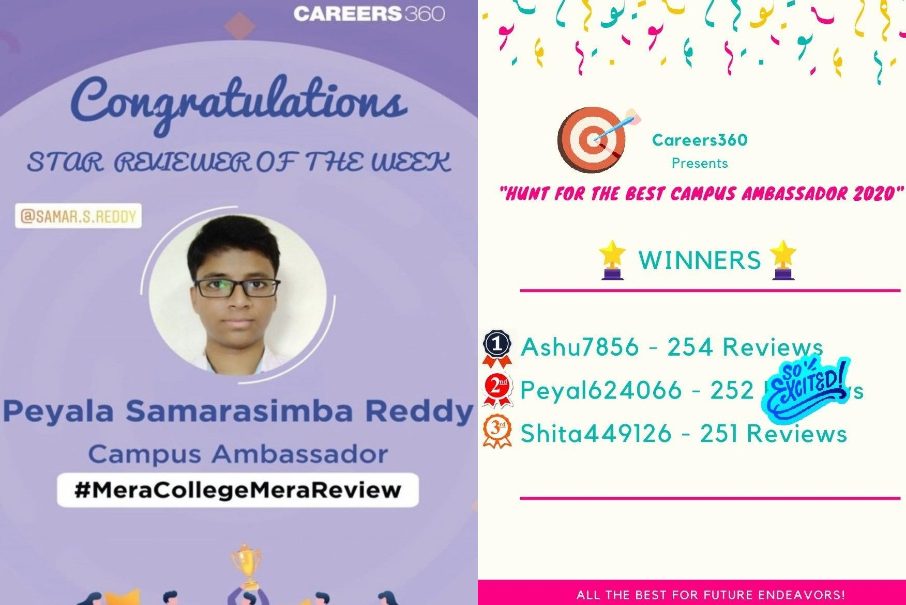
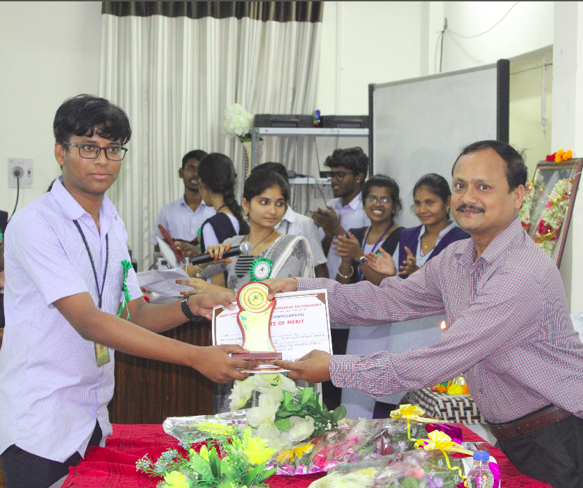
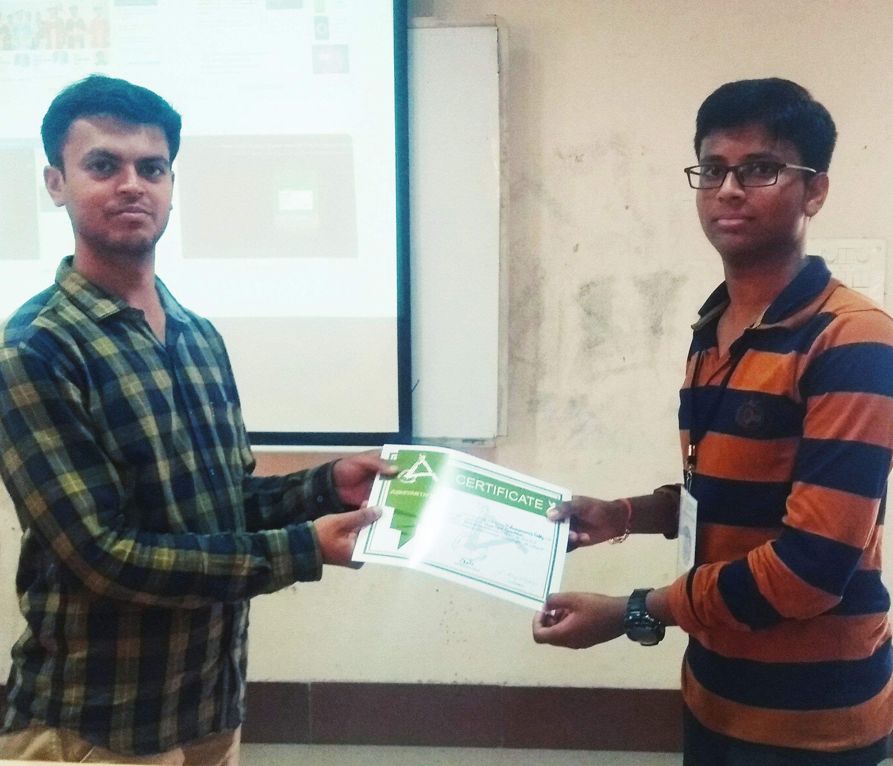
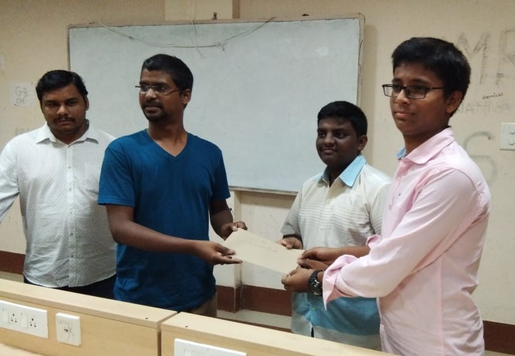
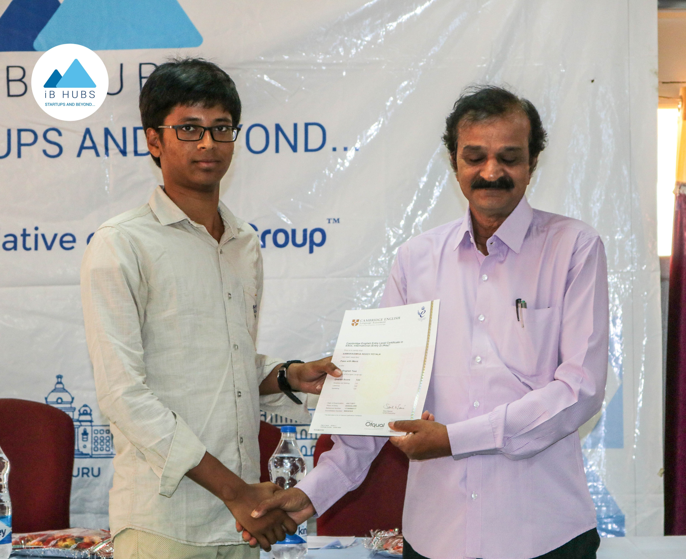
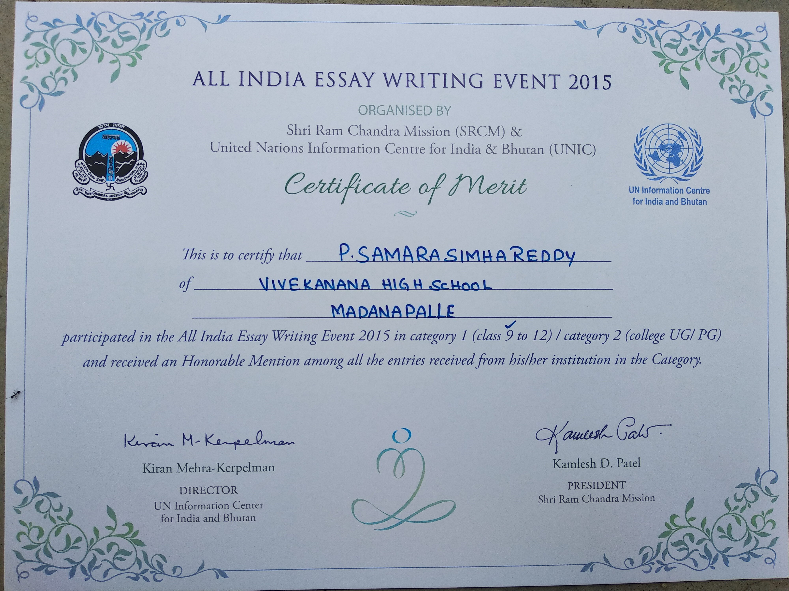

<h1 class="page__title">Awards and Achievements</h1>
      

<section class="page__content" itemprop="text">
    
Throughout my journey, I’ve been honored to receive recognition for efforts. While these accolades reflect my dedication and passion. I’m more interested in participating in competitions and showcasing my skillset, as the true reward lies in my ongoing pursuit of learning, innovation and improvement!

  <h3>Pinnacle Performer Award, Forsys 2023</h3>
  
I was honored to receive the “Pinnacle Performer Award” for my efforts and innovation in work during my time at Forsys. This recognition was awarded at the Forsys annual event, Udaan 2023, Hyderabad.

  <h3>Runner-Up, Careers360 Best Campus Ambassador, 2020</h3>
  
Secured 2nd Position in Careers360 Hunt for Best Campus Ambassador 2020 among 1000+ Campus Ambassadors in India.

  <h3>Second Position in Debate Competition, 2020</h3>
  
Secured 2nd Position in Debate Competition in National Science Day Events 2020 - RGUKT RK Valley.

  <h3>First Position in Presentation competition in Abhiyanth 2K19</h3>
  
Secured 1st Position in Power Point Presentation competition in National Tech Fest Abhiyanth 2019, Presented on Brainwave control System.

  <h3>First Position in Quiz and Debate Competition, Abhiyanth 2k18</h3>
  
Secured 1st Position in Quiz and Debate Competion as a team in National Tech Fest Abhiyanth 2018, Topic on Advanced Physics & Chemistry.

  
  

    <h3>Merit in Cambridge International KET Exam 2017</h3>
    
Recieved the merit certificate of Cambridge ESOL Key English Test exam in 2017, Passed the exam with merit, Level A2.
  

  

  

  <h3>Appreciation in Technical Project Expo in RGUKT University 2nd Convocation, 2017 </h3>
  
Received Appreciation Certificate in Technical Project Exhibition in our University 2nd Convocation, RGUKT-AP in 2017

  <h3>Honorable Mention in All India Essay Writing Event 2015</h3>
  
Received Merit and Honorable Mention among 10 lakh entries in All India Essay Writing Event 2015 by United Nations and SRCM.

   
  <h3>Awarded Gold Medal in TATA India Essay writing - 2015</h3>
  
Honoured to recieve Gold Medal in TATA Building India's National Essay Writing Competition 2015 on Rural Development in India.

 
<h3>Appreciation in INSPIRE Competitions, 2014</h3>

Received Appeciarion Award in Districl Level Science fair INSPIRE awards - 2014, Presented project on global warming reduction and solar energy.

 

      
    </section>

  

