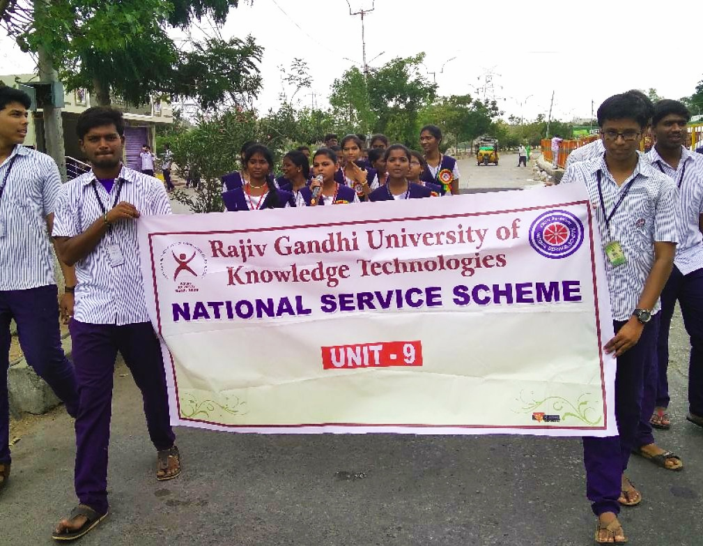
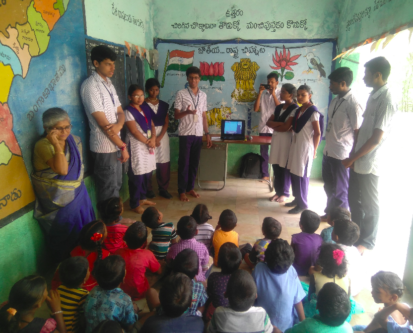
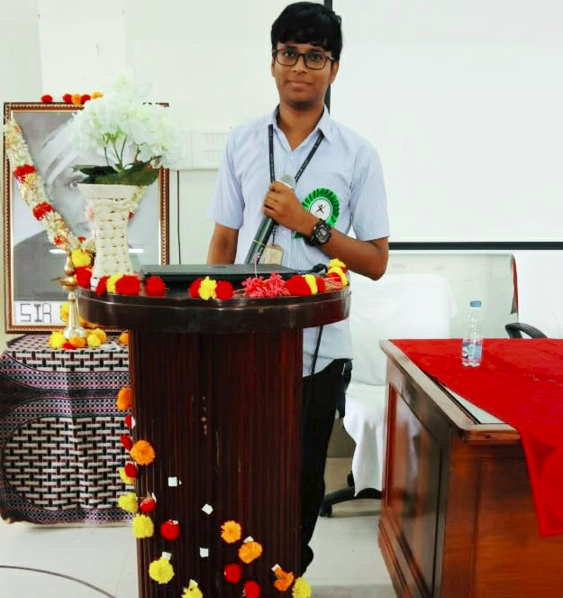
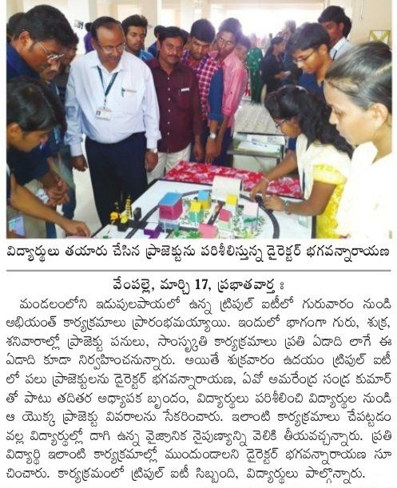
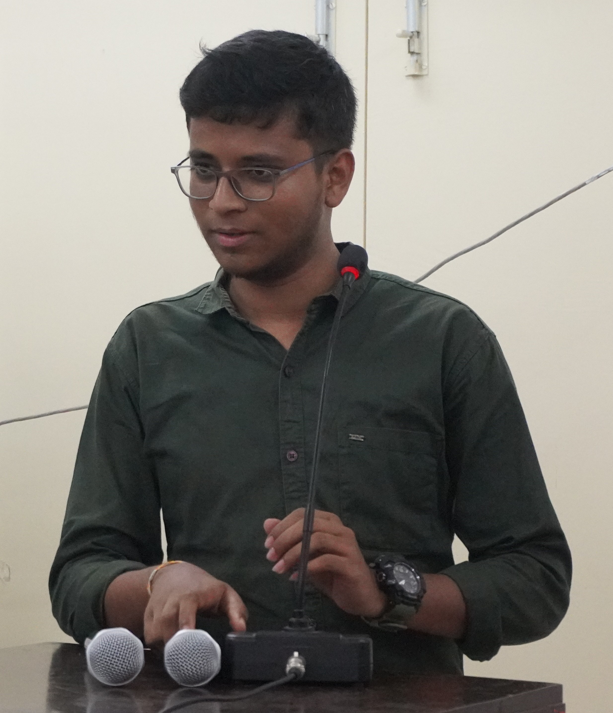

I am always eager to take initiatives and contribute positively, harnessing technology and innovation to give back to my nation. I firmly believe that true success lies in empowering others and uplifting communities through collaboration and shared knowledge.

    
  
   
  

        

            
            
        

        

          
          
          
      

    

     

    
<h1 id="volunteer-experience">Volunteer Experience</h1>
<ul style="font-size: 15px;">
  <li>
    <strong>Program Lead</strong> in <a href="https://konamfoundation.org/" style="color: rgb(16, 158, 176); text-decoration: none;">KONAM Foundation</a><em> (Aug 2023 - Present)</em> 
    <ul>
      <li>Leveraging the potential of Artificial Intelligence to improve lives and livelihoods, precisely for the social good with innovative initiatives.</li>
    </ul>
  </li>
  <li>
    <strong>Executive</strong> in <a href="https://www.linkedin.com/company/helping-hands-organisation-rkvalley/posts/?feedView=all" style="color: rgb(16, 158, 176); text-decoration: none;">Helping Hands Organization RK Valley</a><em> (2017 - 2022)</em> 
    <ul>
      <li>Raising funds from students by donation boxes kept in every classroom for helping the needy.</li>
      <li>Organising events like Chaitra, Pramidha to raise more funds to help needy by the entries students in fun games, competitions etc.</li>
    </ul>
  </li>
  <li>
    <strong>Contributor</strong> in <a href="https://respin.iisc.ac.in/students/peyala%20samarasimha%20reddy" style="color: rgb(16, 158, 176); text-decoration: none;">Signal Processing Interpretation and REpresentation(SPIRE) Lab, IISC Bangalore</a><em> (Aug 2021 - Feb 2022)</em> 
    <ul>
      <li>As a contributor for this project at IISC i.e Speech Recognition in Agriculture and Finance for the Poor in India, I am involving in text data collection, data extraction, running speech models for Telugu Language.</li>
    </ul>
  </li>
  <li>
    <strong>Volunteer and Lead</strong> in National Service Scheme <em>(2016 - 2018)</em> 
    <ul>
      <li>Participated and actively engaged in various service activities like planting, watering, cleaning, door-to-door survey, awareness campaigns, swatchh seva in a one-week camp in our adopted village Kuppalapalle at Vempalle in Feb, 2017 and also a one-week camp in our adopted village Maruthi Nagar and Gandi temple in Dec, 2017.</li>
      <li>Participated and planted 200 plants in a 1-day special camp at our adopted village Kuppalapalle near Vempalle in Oct, 2016.</li>
    </ul>
  </li>
  <li>
    <strong>Content Writer</strong> in <a href="https://www.youtube.com/@rkvabc1630" style="color: rgb(16, 158, 176); text-decoration: none;">RKV Journalism</a> 
    <ul>
      <li>Wrote contents for RKV ABC Channel in the National Techon management cultural fest Abhiyanth 2k18 and 2k19 of IIIT RK Valley.</li>
    </ul>
  </li>
</ul>
 
<h1 id="positions-of-responsibility">Positions of Responsibility</h1>
<ul style="font-size: 15px;">
  <li>
    <strong>External Secretary</strong> in RGUKT RK Valley Alumni Association <a href="https://alumni.rguktrkv.ac.in/" style="color: rgb(16, 158, 176); text-decoration: none;">(RGURAA)</a><em> (Aug 2023 - Present)</em> 
    <ul>
      <li>As a secretary member to bring 10,000+ RKValley alumni together onto a single platform and strive for the overall development of the institute, current and passed-out students.</li>
    </ul>
  </li>
<li>
    <strong>Undergraduate Researcher</strong> in <a href="https://www.linkedin.com/school/roboticsrkv" style="color: rgb(16, 158, 176); text-decoration: none;">Robotics Lab of RKV</a><em> (2018 - 2022)</em> 
    <ul>
      <li>Here where I had great exposure to the research, especially in the field of AI and IoT. We have actively engaged in building the technical projects, participating in tech events. Organised the workshops for the juniors, involved in managing the technical activities inside the institue</li>
    </ul>
  </li>
  <li>
    <strong>Student Coordinator</strong> in <a href="https://www.linkedin.com/company/career-development-and-placement-cell-cdpc-rgukt-rk-valley" style="color: rgb(16, 158, 176); text-decoration: none;">Career Development & Placement Cell</a><em> (2020 - 2022)</em> 
    <ul>
      <li>Involved in the campus placements, trainings for the students, interacted with many HRs from different companies and ensured smooth functioning of the placement drive on-campus.</li>
    </ul>
  </li>
  <li>
    <strong>Student Coordinator</strong> in <a href="https://www.youtube.com/@RGURAA" style="color: rgb(16, 158, 176); text-decoration: none;"> Alumni Cell, IIIT RK Valley</a><em> (2020 - 2022)</em> 
    <ul>
      <li>Coordinating the alumni activities and organizing events, acted as host for the interviews.</li>
    </ul>
  </li>
  <li>
    <strong>Campus Ambassador</strong> in Youth4work<em> (2020)</em> 
    <ul>
      <li>Involved in the marketing for the Datascience courses and trainings for the students for upskilling.</li>
    </ul>
  </li>
  <li>
    <strong>Campus Ambassador</strong> in <a href="https://www.careers360.com/" style="color: rgb(16, 158, 176); text-decoration: none;">Careers360</a><em> (2020)</em> 
    <ul>
      <li>Involved in genuine campus review writings from the students for their colleges on the careers360 platform.</li>
    </ul>
  </li>
  <li>
    <strong>Internshala Student Partner</strong> in <a href="https://internshala.com/" style="color: rgb(16, 158, 176); text-decoration: none;">Internshala</a><em> (2020)</em> 
    <ul>
      <li>Created the workshops on placements, trainings, internships to get easily with improving the resume writing skills, upskilling through courses online etc.</li>
    </ul>
  </li>
</ul>
