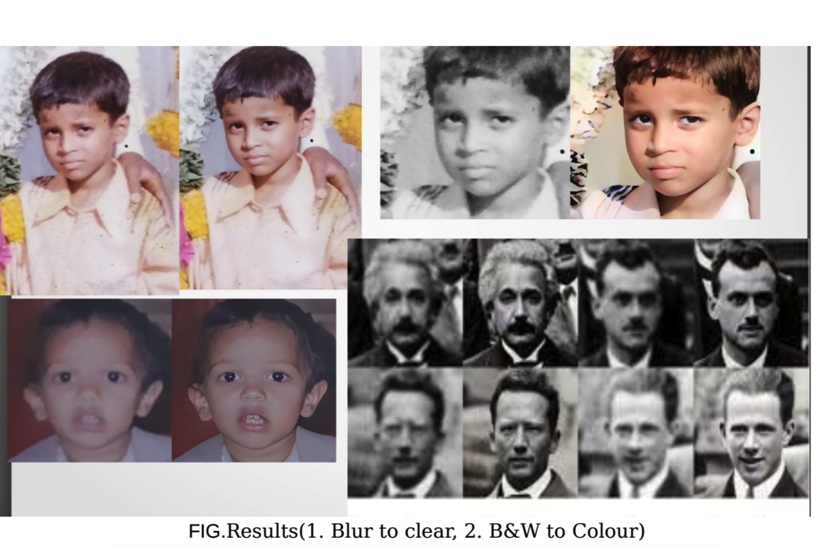



<head>
  
</head>

  <h1 class="page__title"></h1>
  
I have listed out only a few academic and internship projects

  <h1 id="education"><strong>Academic and Internship Projects</strong></h1>

  <table style="border: none; border-collapse: collapse;" onmouseover="this.style.backgroundColor='#f0f0f0';" onmouseout="this.style.backgroundColor='';">
      <tbody>
          <tr>
              <td style="width:200px; height:200px; vertical-align: top; border: none;">
                  
              </td>
              <td style="height: 200px; vertical-align: top; border: none; color: #1B1212; font-size: 15px;">
                  

                      Samarasimha Reddy  
                      <strong>Blind Face Restoration and Image Enhancement</strong>  
                      <i>Apr, 2022 <a href="https://github.com/samarasimhapeyala" style="color: #2985d8; text-decoration: none;">[Code]</a></i> 
                      <i>Trained the GFP-GAN on the FFHQ dataset, generating color images from black and white and enhancing old images into high resolution.</i>
                  

              </td>
          </tr>
      </tbody>
  </table>

  <!-- Repeat similar table structure for other projects -->
  
  <table style="border: none; border-collapse: collapse;" onmouseover="this.style.backgroundColor='#f0f0f0';" onmouseout="this.style.backgroundColor='';">
      <tbody>
          <tr>
              <td style="width:200px; height:200px; vertical-align: top; border: none;">
                  
              </td>
              <td style="height: 200px; vertical-align: top; border: none; color: #1B1212; font-size: 15px;">
                  

                      Samarasimha Reddy  
                      <strong>Evaluating LMU with Attention LSTM Models on Time Series Data</strong>  
                      <i>July, 2021 <a href="https://github.com/samarasimhapeyala" style="color: #2985d8; text-decoration: none;">[Code]</a></i> 
                      <i>Implemented LMU Models on timeseries data and evaluated them with attention LSTM models during my Research Internship at IIT Guwahati.</i>
                  

              </td>
          </tr>
      </tbody>
  </table>

  <!-- Continue with the remaining tables... -->

